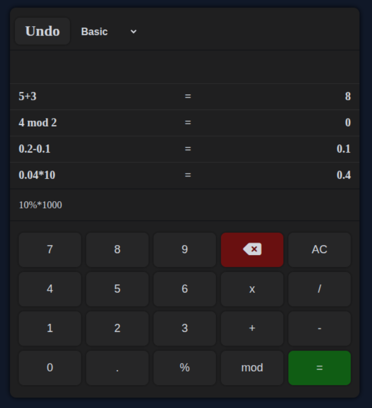

# Calculator

>A basic calculator illustrating the use of vanilla JavaScript, HTML, and CSS to create a functional and interactive user interface.

## Features
- Addition, subtraction, multiplication division and modulus operations
- Percentage calculation
- All Clear (AC) button to reset the calculator
- Delete button to clear the input display screen
- Undo functionality to revert every previous action step by step

## Atrributions

*For the calculator icon. Just click on the icon to visit the website.*
